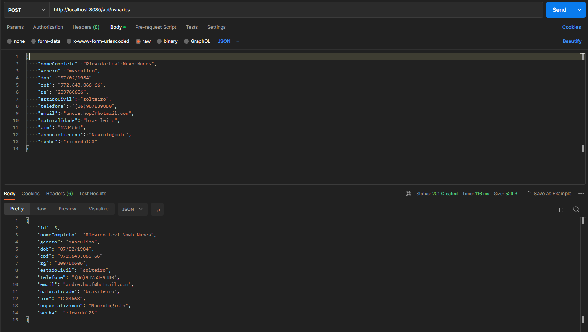
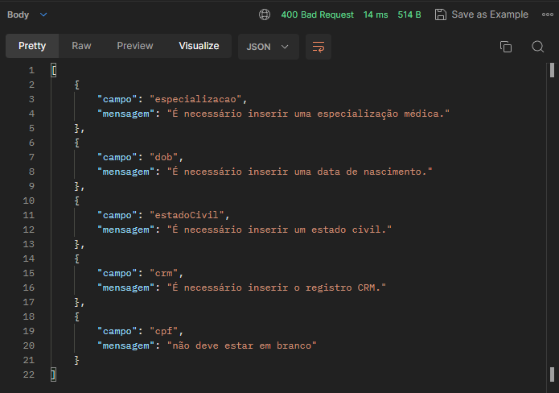
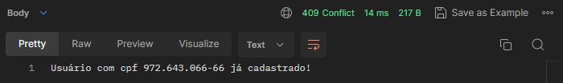
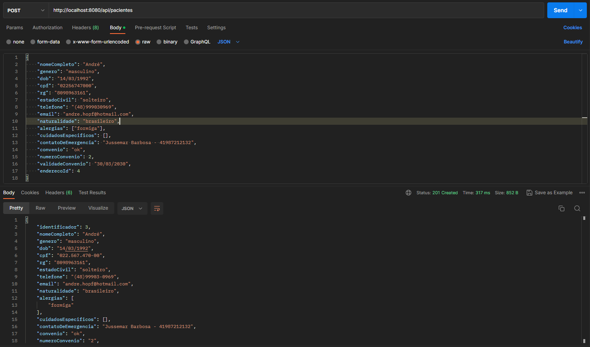
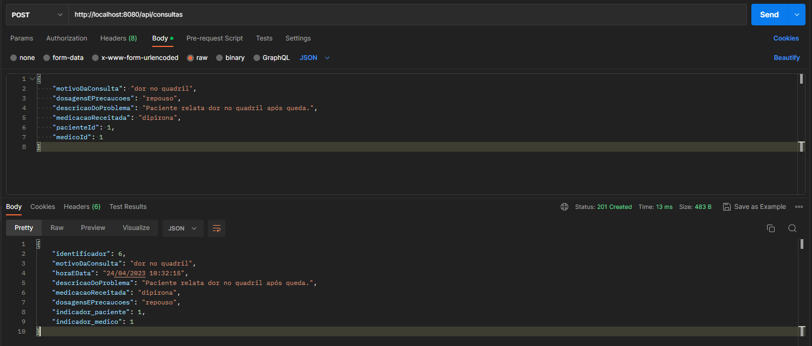
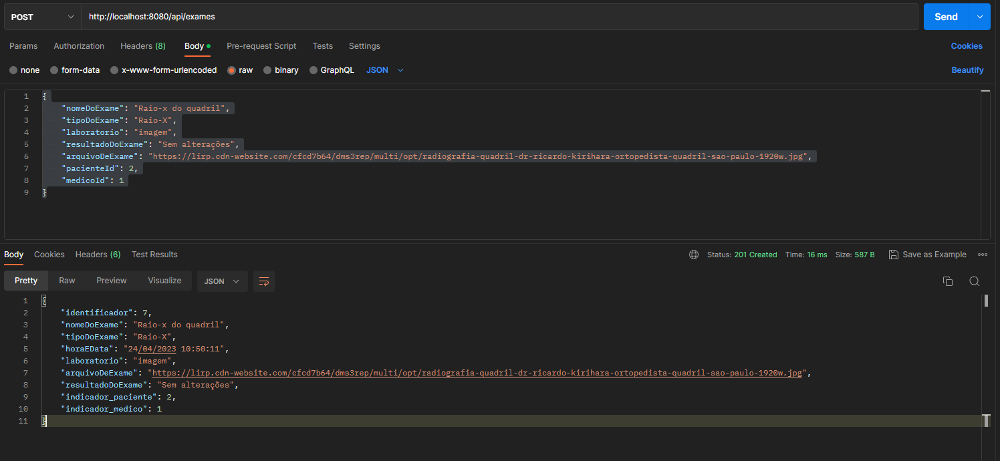
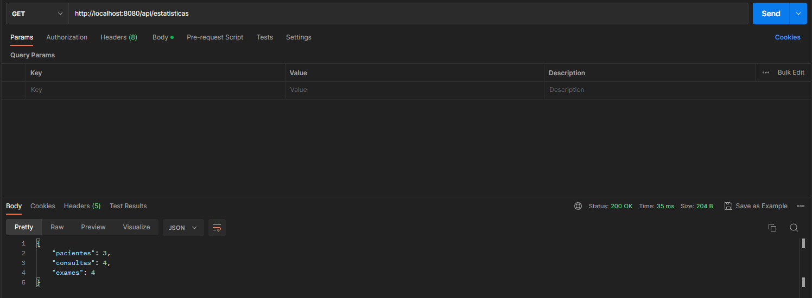
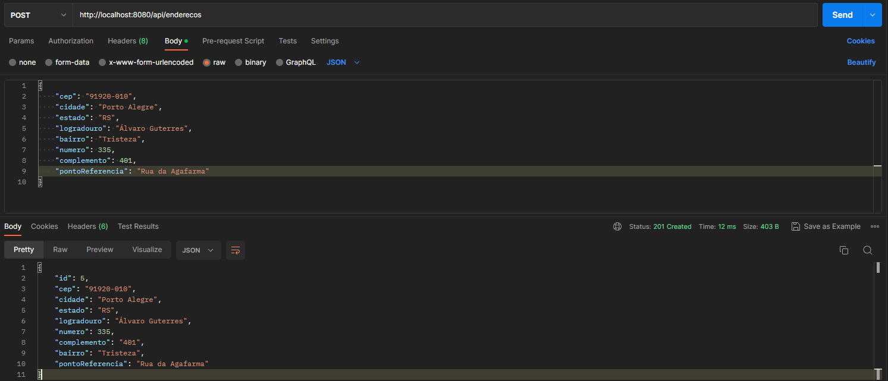

# APIMedical

## Conteúdos:

- [Introdução](#introdução)
- [Entidades e Endpoints](#Entidades-e-endpoints)
  - [Pessoa](#Pessoa)
  - [Usuário / Médico](#usuario--médico-)
    - [Cadastrar usuário](#1-cadastrar-usuário-)
    - [Atualizar usuário](#2-atualizar-dados-de-usuário-)
    - [Atualizar senha de usuário](#3-atualizar-senha-de-usuário-)
    - [Obter usuários](#4-obter-todos-usuários-)
  - [Paciente](#paciente)
    - [Cadastrar paciente](#1-cadastrar-paciente-)
    - [Atualizar paciente](#2-atualizar-paciente)
    - [Listagem de pacientes](#3-listagem-de-todos-pacientes)
    - [Listar paciente pelo identificador](#4-listagem-de-um-paciente-pelo-identificador)
  - [Consulta](#consulta)
    - [Cadastrar consulta](#1-cadastro-de-consulta)
    - [Atualizar consulta](#2-atualização-dos-dados-de-consulta)
    - [Listar consulta pelo identificador](#3-listagem-de-consulta-pelo-identificador)
    - [Excluir consulta](#4-exclusão-de-consulta)
  - [Exame](#exame)
    - [Cadastrar exame](#1-cadastro-de-exame)
    - [Atualizar exame](#2-atualização-dos-dados-de-exame)
    - [Listar exame pelo identificador](#3-listagem-de-exame-pelo-identificador)
    - [Excluir exame](#4-exclusão-de-exame)
  - [Estatísticas do Sistema](#estatísticas-do-sistema)
  - [Endereço](#endereço)
    - [Cadastrar endereço](#1-cadastro-de-endereço)
    - [Listagem de endereços](#2-listagem-de-endereços)
- [Status de Respostas](#status-de-resposta)
  - [200 - Ok](#200-ok)
  - [201 - Created](#201-created)
  - [204 - No Content](#204-no-content)
  - [400 - Bad Request](#400-bad-request)
  - [404 - Not Found](#404-not-found)
  - [409 - Conflict](#409-conflict)
- [Collection Postman](#)
- [Tecnologias Utilizadas](#tecnologias-utilizadas)
- [Executando a aplicação](#executando-a-aplicação)
- [Melhorias futuras](#melhorias-futuras)
- [Vídeo Explicativo](#link-para-vídeo-explicativo-do-sistema)

<hr>

## Introdução

Bem vindo ao back-end do sistema labMedical - a APIMedical!

Esta é uma API Rest desenvolvida em Java utilizando o framework Spring e o banco de dados SQL Oracle.

Visite [aqui](https://github.com/ajhopf/LABMedical) o front-end da aplicação (ainda sem integração com o back-end).

Através desta aplicação é possível:

* Criar e manipular dados em suas respectivas tabelas no banco de dados Oracle;
* Validar as informações recebidas a partir das requisições antes de fazer alterações no banco de dados;
* Obter estatísticas do sistema.
<hr>

## Entidades e endpoints

## Pessoa

Classe abstrata que contém dados que deverão existir tanto nas entidades 'medico' e 'paciente'.


## Usuario (médico)

Entidade que herda de Pessoa.

Tabela: 'usuarios'

### 1. Cadastrar usuário:
   * Método: POST
   * Endpoint: /api/usuarios;
   * Os campos obrigatórios serão validados pelo sistema, sendo informado na resposta se algum erro ocorreu.
   * Campos , obrigatoriedade e tipo:

```json
{
  "nomeCompleto": "Ricardo Levi Noah Nunes", //não obrigatório - String
  "genero": "masculino", //não obrigatório - String
  "dob": "07/02/1984", //obrigatório - String - Data válida
  "cpf": "972.643.066-66", //obrigatório - String - CPF válido
  "rg": "209760606", //não obrigatório - String
  "estadoCivil": "solteiro", // obrigatório - String
  "telefone": "(86)987539880", // não obrigatório - String - se presente, telefone no formato (DD)99999-9999
  "email": "ricardo.levi@hotmail.com", // não obrigatório - String - se presente, email válido
  "naturalidade": "brasileiro", // não obrigatório - String
  "crm": "1234568", //obrigatório - String
  "especializacao": "Neurologista", //obrigatório - String
  "senha": "ricardo123" //não obrigatório - String - se presente, mínimo 8 caracteres
}
```

   
   * Exemplo de requisição válida:

   

   * Exemplos de respostas de requisições com erros:

   

   

 
### 2. Atualizar dados de usuário:

* Médoto: PUT
* Endpoint: /api/usuarios/{identificador}
* Neste endpoint nenhum campo é obrigatório. Apenas os campos que forem enviados na requisição serão validados e atualizados.
* Não é possível alterar o CPF e/ou RG de um usuário.
   
### 3. Atualizar senha de usuário:

* Método: PUT
* Endpoint: /api/usuarios/{identificador}/senha
* A senha deve ter mais de 8 caracteres.

### 4. Obter todos usuários:

* Método: GET
* Endpoint: /api/usuarios

## Paciente

Entidade que herda de Pessoa.

Tabela: 'pacientes'

### 1. Cadastrar paciente:
* Método: POST
* Endpoint: /api/pacientes;
* Os campos obrigatórios serão validados pelo sistema, sendo informado na resposta se algum erro ocorreu.
* Esta entidade possui os campos 'alergias' e 'cuidadosEspecificos' que deverão ser enviados em formato de array. Ao receber a requisição, o sistema irá percorrer estes arrays e irá inserir uma nova linha para cada item em suas respectivas tabelas ('alergias' ou 'cuidados_especificos'), contendo o identificador do paciente a quem ele está vinculado (FK).
* Campos, obrigatoriedade e tipo

```json
{
  "nomeCompleto": "Eduardo Barbosa", //não obrigatório - String
  "genero": "masculino", //não obrigatório - String
  "dob": "07/08/1991", //obrigatório - String - Data válida
  "cpf": "972.643.066-66", //obrigatório - String - CPF válido
  "rg": "209760606", //não obrigatório - String
  "estadoCivil": "solteiro", // obrigatório - String
  "telefone": "(41)999030959, // não obrigatório - String - se presente, telefone no formato (DD)99999-9999
  "email": "eduardo.barbosinha@hotmail.com", // não obrigatório - String - se presente, email válido
  "naturalidade": "brasileiro", // não obrigatório - String
  "alergias": ["formiga"], //não obrigatório - Array de String
  "cuidadosEspecificos": [], // não obrigatório - Array de String
  "contatoDeEmergencia": "Jussemar Barbosa - 41987212132", // obrigatório - String
  "convenio": "ok", // não obrigatório - String
  "numeroConvenio": 2, // não obrigatório - String
  "validadeConvenio": "30/03/2030", // não obrigatório - String - se presente, data válida
  "enderecoId": 4 // obrigatório - Integer - identificador de um Endereço salvo na tabela 'enderecos'
}
```

Exemplo de requisição válida:



### 2. Atualizar paciente

* Médoto: PUT
* Endpoint: /api/pacientes/{identificador}
* Neste endpoint nenhum campo é obrigatório. Apenas os campos que forem enviados na requisição serão validados e atualizados.
* Não é possível fazer alteração do CPF e/ou RG.

### 3. Listagem de todos Pacientes

* Método: GET
* Endpoint: /api/pacientes
* Este endpoint pode receber um query param opcional ("nome") que, se utilizado, irá fazer a filtragem do resultado pelo nome do paciente.

### 4. Listagem de um paciente pelo identificador

* Método: GET
* Endpoint: /api/pacientes/{identificador}

### 5. Exclusão de Paciente

* Método: DELETE
* Endpoint: /api/pacientes/{identificador}
* Não é possível excluir um paciente que possua exame ou consulta vinculado.
* Ao excluir um paciente os dados vinculados a este paciente nas tabelas 'alergias' e 'cuidados_especificos' tabém serão excluídos.

## Consulta

Tabela: 'consultas'

### 1. Cadastro de Consulta

* Método: POST
* Endpoint: /api/consultas
* Ao cadastrar uma consulta, a hora e a data do sistema serão automaticamente vinculadas ao registro
* As consultas devem possuir um paciente e um médico vinculados a ela (através do identificador)
* Campos, obrigatoriedade e tipo:

```json
{
  "motivoDaConsulta": "dor no quadril", //obrigatório - String
  "dosagensEPrecaucoes": "repouso", //obrigatório - String
  "descricaoDoProblema": "Paciente relata dor no quadril após queda.", //obrigatório - String
  "medicacaoReceitada": "dipirona", //obrigatório - String
  "pacienteId": 1, //obrigatório - Long
  "medicoId": 1 //obrigatório - Long
}
```

Exemplo de requisição válida:



### 2. Atualização dos dados de Consulta

* Método: PUT
* Endpoint: /api/consultas/{identificador}
* Nenhum campo é obrigatório nesta requisição. Apenas os campos que forem enviados na requisição serão validados e atualizados.
* Não é possível alterar a data e hora de uma consulta

### 3. Listagem de Consulta pelo identificador

* Método: GET
* Endpoint: /api/consultas/{identificador}

### 4. Exclusão de Consulta

* Método: DELETE
* Endpoint: /api/consultas/{identificador}

## Exame

Tabela: 'exames'

### 1. Cadastro de Exame

Método: POST
* Endpoint: /api/exames
* Ao cadastrar um exame, a hora e a data do sistema serão automaticamente vinculadas ao registro
* Os exames devem possuir um paciente e um médico vinculados (através do identificador)
* Campos, obrigatoriedade e tipo:
```json
{
  "nomeDoExame": "Raio-x do quadril", //obrigatório - String
  "tipoDoExame": "Raio-X", // obrigatório - String
  "laboratorio": "imagem", // obrigatório - String
  "resultadoDoExame": "Sem alterações", // obrigatório - String
  "arquivoDeExame": "https://lirp.cdn-website.com/cfcd7b64/dms3rep/multi/opt/radiografia-quadril-dr-ricardo-kirihara-ortopedista-quadril-sao-paulo-1920w.jpg", //não obrigatório - String
  "pacienteId": 2, // obrigatório - Long
  "medicoId": 1 // obrigatório - Long
}
```

Exemplo de requisição válida:



### 2. Atualização dos dados de Exame

* Método: PUT
* Endpoint: /api/exames/{identificador}
* Nenhum campo é obrigatório nesta requisição. Apenas os campos que forem enviados na requisição serão validados e atualizados.
* Não é possível alterar a data e hora de um exame

### 3. Listagem de Exame pelo identificador

* Método: GET
* Endpoint: /api/exames/{identificador}

### 4. Exclusão de Exame

* Método: DELETE
* Endpoint: /api/exames/{identificador}

## Estatísticas do Sistema

Listagem da quantidade de pacientes, consultas e exames cadastrados no sistema.

* Método: GET
* Endpoint: /api/estatisticas

Exemplo de resposta de requisição:



## Endereço

Tabela: 'enderecos'

### 1. Cadastro de Endereço

* Método: POST
* Endpoint: /api/enderecos
```json
{
  "cep": "91920-010", //obrigatório - String
  "cidade": "Porto Alegre", //obrigatório - String
  "estado": "RS", //obrigatório - String com 2 caracteres
  "logradouro": "Álvaro Guterres", //obrigatório - String
  "bairro": "Tristeza", //obrigatório - String
  "numero": 335, //obrigatório - Number
  "complemento": 401, //não obrigatório - String
  "pontoReferencia": "Rua da Agafarma"// não obrigatório - String
}
```

Exemplo de requisição válida:



### 2. Listagem de Endereços

* Método: GET
* Endpoint: /api/enderecos

<hr>

## Status de resposta

### 200 Ok

Resposta em caso de sucesso na atualização dos dados, constando no corpo da reposta os dados atualizados.

### 201 Created

Resposta em caso de sucesso ao inserir um novo dado no DB, constando no corpo da resposta os dados cadastrados, assim como o identificador(id)
 vinculado.

### 204 No Content

Resposta em caso de exclusão de dados com sucesso.

### 400 Bad Request

Resposta em caso de envio de dados obrigatórios ausentes ou dados inválidos na requisição.

### 404 Not Found

Resposta em caso de requisição com identificador não existente no DB.

### 409 Conflict

Reposta em caso de tentativa de cadastro de um CPF já cadastrado na tabela.

<hr>

## Collection Postman

Você pode encontrar uma collection do postman contendo todos os endpoints e exemplos de requisição na pasta raiz deste projeto. [arquivo](https://github.com/ajhopf/labmedical-backend/blob/main/Labmedical.postman_collection.json).

<hr>

## Tecnologias Utilizadas

Para o desenvolvimento deste projeto foi utilizado o framework Spring.
A configuração inicial do projeto foi feita através do [spring initializr](https://start.spring.io/).

As dependências utilizadas foram:
  * Spring Web
  * Spring Data JPA
  * Oracle Driver
  * Commons Validator
  * Mapstruct

Foram criados 6 [validators](https://github.com/ajhopf/labmedical-backend/tree/main/src/main/java/br/com/labmedical/backend/validators) customizados para a validação dos dados das requisições, sendo realizada as seguintes validações:

* [Data](https://github.com/ajhopf/labmedical-backend/tree/main/src/main/java/br/com/labmedical/backend/validators/datavalida)
* [Data de Nascimento](https://github.com/ajhopf/labmedical-backend/tree/main/src/main/java/br/com/labmedical/backend/validators/dob)
* [Especialização Médica](https://github.com/ajhopf/labmedical-backend/tree/main/src/main/java/br/com/labmedical/backend/validators/especializacao)
* [Estado Civil](https://github.com/ajhopf/labmedical-backend/tree/main/src/main/java/br/com/labmedical/backend/validators/estadocivil)
* [Gênero](https://github.com/ajhopf/labmedical-backend/tree/main/src/main/java/br/com/labmedical/backend/validators/genero)
* [Telefone](https://github.com/ajhopf/labmedical-backend/tree/main/src/main/java/br/com/labmedical/backend/validators/telefonevalido)

Para a transferência de dados dentro da aplicação foram utilizados DTOs, nunca enviando como resposta a entidade 'crua' vinda do DB.

Para o mapeamento das requisições foram utilizados controllers, para a lógica de negócio foi utilizada uma camada de service e, por fim, para a conexão com o banco de dados foi utilizada uma camada Repository.

<hr>

## Executando a aplicação

Para executar a aplicação, primeiro você deve ter instalado em sua máquina o banco de dados Oracle. Você pode encontrar o link para download e instruções de instalação [aqui](https://www.oracle.com/br/database/technologies/appdev/xe.html).

Você deverá criar um banco de dados, usuário e senha. Estes dados serão necessários para fazer a conexão do sistema labMedical com o banco de dados.

Para isso você deve acessar o arquivo application.properties, na pasta resources, e atualizar os seguinte campos com suas informações:

1. spring.datasource.url=[inserir-aqui-a-porta-e-nome-do-banco-de-dados] -> porta e nome do banco de dados
2. spring.datasource.username=[inserir-aqui-nome-do-usuario] -> nome do usuário
3. spring.datasource.password=[inserir-aqui-senha-do-usuario] -> senha do usuário

Esta configuração já está feita no arquivo contido neste projeto, porém pode ser necessário atualizar os dados para que estes estejam de acordo com as suas configurações.

### Dados iniciais

Na pasta resources, você poderá encontra o arquivo [data.sql](https://github.com/ajhopf/labmedical-backend/blob/main/src/main/resources/data.sql).

Este arquivo contém os scripts necessário para a criação de 2 pacientes, 2 médicos, 4 exames, 4 consultas e 4 endereços.

Estamos utilizando as seguinte configurações no application.properties:

* spring.jpa.hibernate.ddl-auto=create-drop -> cria as tabelas ao inicializar o sistema, exclui as tabelas ao terminar.
* spring.sql.init.mode=always -> permite utilizar os scripts durante a inicialização
* spring.jpa.defer-datasource-initialization=true -> cria as tabelas antes de inserir os dados do arquivo data.sql

Portanto sempre que desligarmos o sistema, as tabelas serão excluídas, evitando a duplicação dos dados contidos no arquivo data.sql.

<hr>

## Melhorias futuras

Alguns pontos que ainda podem ser melhorados neste projeto:

* Utilizar autenticação com JWT para realizar as requisições;
* Utilizar ENUMS para especializações médicas, genero e estado civil;
* Refatorar os métodos de atualização das entidades;
* Integrar o sistema com o front-end.

<hr>

## Link para vídeo explicativo do sistema

[Link para o vídeo](https://drive.google.com/file/d/1KFtc0iECGQWmDcWPjFYt4XvZ3yQ38-Pw/view?usp=sharing)


 


